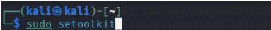
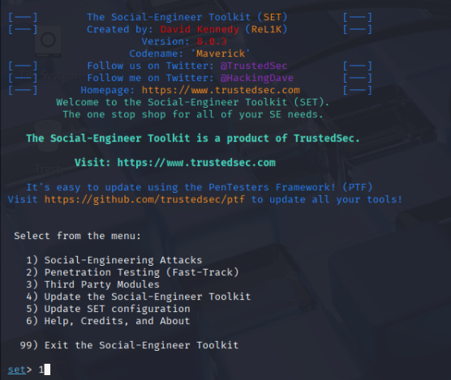
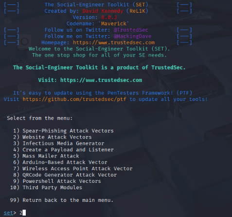
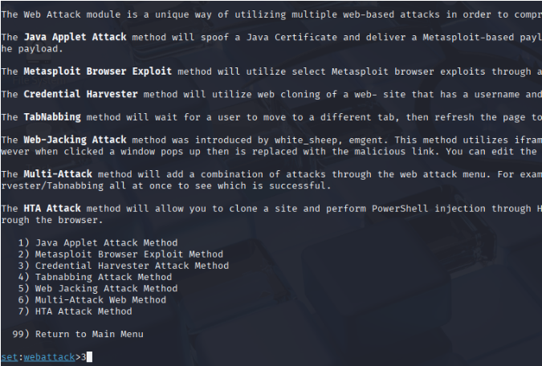
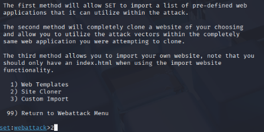
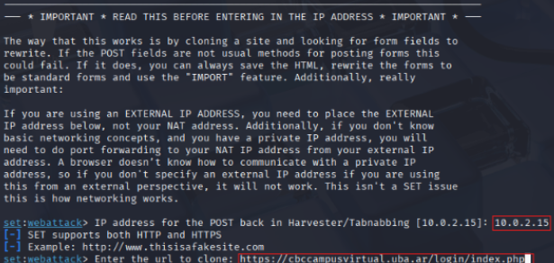
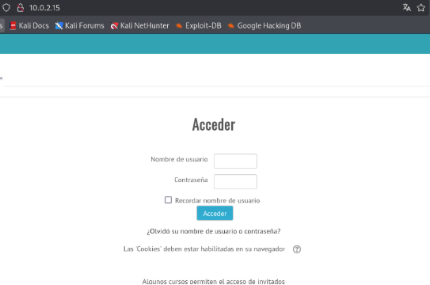
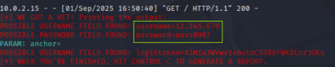
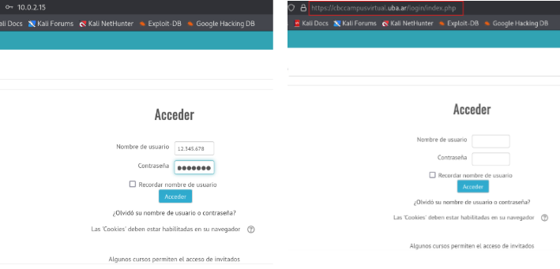

# Social Engineering Lab

## Objective

Demonstrate how phishing attacks can be used to harvest credentials through cloned websites and analyze defensive measures that organizations and users can implement to reduce risk.

## Scope

This project was conducted in a controlled laboratory environment for educational purposes.

The objective was to understand the mechanics of phishing attacks, identify indicators of compromise and evaluate mitigation strategies.

## Tools Used

* Kali Linux
* Social-Engineer Toolkit (SET)

## Attack Scenario

A credential harvesting attack was simulated against a university virtual campus login page.

The target website was cloned using the Social-Engineer Toolkit (SET), generating a phishing page visually identical to the original login portal.

When a user submitted credentials through the cloned page, the information was captured and the victim was redirected to the legitimate website.

## Attack Workflow

1. Launch SET.
   
   
   
2. Select Social Engineering Attacks.
   
   
   
3. Select Website Attack Vectors.
   
   
  
4. Select Credential Harvester Attack Method.
   
   
   
5. Select Site Cloner.
    
   
   
6. Configure target URL and attacker IP.
    
    
    
7. Generate phishing page.
    
    
    
8. Capture submitted credentials.
    
    
    
9. Redirect victim to the legitimate website.
    
    
    

## Security Risks

This type of attack exploits human behavior rather than technical vulnerabilities.

Common attack vectors include:

* Email phishing campaigns
* SMS phishing (smishing)
* Fake password reset requests
* Account verification messages
* Urgent security notifications

## Mitigation Strategies

### User Awareness

Users should verify:

* Domain names
* Sender identity
* HTTPS usage
* Unexpected login requests

### Multi-Factor Authentication (MFA)

Even if credentials are compromised, MFA can significantly reduce the likelihood of unauthorized access.

### Organizational Controls

Organizations should implement:

* Security awareness training
* Email filtering
* Web Application Firewalls (WAF)
* Domain monitoring
* Least privilege principles

## Key Takeaways

Phishing remains one of the most effective attack techniques because it targets human trust rather than software vulnerabilities.

Technical controls are important, but user awareness remains one of the strongest defenses against credential harvesting attacks.

## Disclaimer

This project was conducted exclusively in a controlled educational environment.

No unauthorized systems, users or organizations were targeted.
